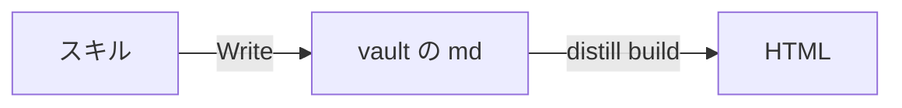

技術スタックと意思決定の背景を抽出し、技術・設計判断・変更内容を同時に学べる教材を生成する。

出力は「変更の記録だけ」ではなく「教材」。読者が以下を理解できる状態で、エンジニアとしてスキルアップできることをゴールとする:

- 何をしたか（What）
- なぜそれをしたか（Why）
- どういう選択肢の中でその判断になったか（Decision）
- 次に自分のプロジェクトへどう応用するか（Apply）
- 具体的に何が変わったか（Change）

## いつ実行するか

次のどちらかで起動する。**どちらでも出力は同じ型**（「出力テンプレート」節）。
モードや引数で分岐させない。

**A. 実装完了後** — 実装・修正・調査が終わった直後。feature-dev の Execute 完了後は
確認なしで自動実行。手動は `/distill-教材`。

**B. 説明が通じなかったとき** — 「もっと根本から」「全然わからない」「用語から
説明して」等、**前提を落とした説明を明示的に求められた**とき。察して勝手に
噛み砕きにいかない。

B のときは冒頭 1 行で**どこから説明を始めるかを宣言する**。ユーザーが
「そこは分かる」と即座に打ち返せるようにするため。宣言せずに説明を始めない。

> 例: 「Web システムが 3 層（ブラウザ / サーバー / データベース）でできている
> ことから説明します」

同じ対象で 2 回続けて前提を下げても通じないときは、**説明を続けない。**
「どこまで理解できたか」を質問して止める。

**実装が完了したタイミングで、ユーザーに確認を取らずに本スキル全体に従い教材を作成する。**

次のいずれかに該当したら **必ず実行** する:

- 依頼された実装・修正・リファクタが完了し、ユーザーに完了を報告する**直前または直後**
- テスト・検証コマンドが成功し、タスク完了と判断できるとき
- `feature-dev` 等で **実装フェーズ（Execute 等）が完了** し、次フェーズへ進む前
- ユーザーが「完了」「これでいい」「マージして」等、実装の締めを示したとき

**手動指定（`/distill-教材` の invoke、「教材を出して」等）:** 上記と**同じフロー**。自動と同様、**元データは必ず直前・直近の実装内容のみ**とする（この会話で直前に完了した実装・編集したファイル・行った判断）。手動だからといって commit 履歴や別セッションに切り替えない。

### 実行時のルール

- **「教材を作りますか？」と聞かない。** 保存先も確認しない（「保存先」節のパスに固定）。
- **確認は一切しない。** 作るかどうかも、保存先も、他スキルの起動も問わない。
- **教材の本文を会話に出さない。** 完了報告は「完了報告」節のとおり URL だけにする（スキップした場合は理由のみ）。
- 判断に迷ったら **スキップしない**（ファイルを作成する）。

### スキップ（教材ファイルを作らない）の条件

次を**すべて**満たすときだけ省略可。その場合は会話で**スキップ理由を1文**述べる。

- 変更が極小（誤字のみ、コメント1行のみ、設定値1項目のみ等）
- 学習価値のある技術・判断が抽出できないと**明確**に判断できる

## 保存先

`$HOME/develop/obsidian/99_distill/教材/<タイトル>.md` に **Write で書く**。
保存先は確認しない。distill のコマンドは呼ばない。

- ファイル名 = `<技術テーマ>を理解する.md` 等の読める日本語タイトル（日付の
  接頭辞は付けない。Obsidian のインラインタイトルがそのまま見出しになる）。
  同名衝突時のみ末尾に ` 2` 等を付す
- ディレクトリが無ければ作成する
- 先頭に frontmatter を置く:

```yaml
---
date: <date +%F の結果>
project: <basename $(pwd) の結果>
---
```

`project` は**作業リポジトリのディレクトリ名**（例: `dxp`）。distill がこれを
`projects.cwd` のベース名と突き合わせ、その プロジェクトのページに教材を出す。
解決できない場合は vault 共通の受け皿に入るので、書けない値でも支障はない。

- frontmatter の直後に `# タイトル` を 1 行置く（Obsidian で開いたときの見出し）
- 本文は `##` から始める

書いたら distill 側の操作は不要。`distill serve` の起動時と
`distill export-static` の実行時に vault を読み直すので、次に見るときには
反映されている。

## 実行フロー（この順で行う）

1. **直前の実装**について、変更されたファイル・追加されたコード・行われた判断を特定する（自動・手動とも同じ）
2. 技術要素・**専門用語・実行した手順**と意思決定シグナルを抽出する
3. メイントピックを選定する（後述の**ゼロベース解説**対象はメインから外さない）
4. `99_distill/教材/` の既存教材と重複しないようトピックを調整する
5. メイントピックおよび Step 2.3 の各用語について、context7 / WebSearch で一次情報を補強する（用語の定義を推測で書かない）
6. 実装解説 + 技術解説 + **ゼロベース用語解説** + 判断背景を統合し、`99_distill/教材/<タイトル>.md`（読みやすい日本語タイトル）に出力する
7. 「保存前セルフチェック」節を通す（必須）
8. 「完了報告」節に従い、サイトを更新して URL を出す

### Step 1: 直前の実装内容の特定

- 会話内で**直前の実装**として編集・作成したファイルを列挙する（ツールで触れたパス、ユーザー言及のパス）
- 実装の要約を1–3文で書く（何を追加・変更・削除したか）
- 影響範囲（モジュール・設定・ドキュメント）を把握する

### Step 2: 技術と意思決定シグナルの抽出

実装に登場する要素を**漏れなく**列挙する。

| カテゴリ                 | 抽出対象                                                                                |
| ------------------------ | --------------------------------------------------------------------------------------- |
| 言語・構文               | 使った型・構文・イディオム                                                              |
| ライブラリ               | import/require、設定で参照したツール                                                    |
| 外部サービス             | API・SDK・設定・CLI                                                                     |
| 設計パターン             | 採用した構造・パターン                                                                  |
| AIシステム               | プロンプト、ツール定義、エージェント構成、スキル設計                                    |
| 開発プラクティス・ツール | lint / format / typecheck / test / CI・ビルド・デプロイで触れた概念・コマンド・設定キー |

**意思決定シグナル:** 解決した問題、判断を縛った制約、トレードオフ、ユーザーとのやり取りで分かった「なぜその方針か」。

### Step 2.3: 専門用語・手順の洗い出し（ゼロベース解説の入力）

実装や会話に**一度でも出た**ものは候補にする。省略しない。

- **用語:** 略語（lint, CI, AST, middleware 等）、プロダクト名・CLI 名、設定ファイルの役割
- **手順:** 「〜を実行した」「〜で確認した」とある操作（例: `npm run lint`、`read_lints`、pre-commit）
- **各候補について教材内で答えるべき最低限:** **それとは何か** → **何のためにあるか** → **今回の実装ではどう関係したか**（3段）

例: 実装で lint を回した → **Lint（リンター）とは** 静的解析でスタイル・バグ候補を検出するツール群の総称、**なぜ使うか** レビュー前に共有ルールで品質を揃える、**今回** ESLint で unused import を検出して削除した、まで書く。

### Step 2.5: 解説ポイントの整理

- **何を実装したか** / **なぜそうしたか** / **どう実装したか**
- **何を守ったか**（互換性・可読性・一貫性等）
- **何を見送ったか**（スコープ外と理由。分かる範囲で）

### Step 3: メイントピック選定

- 実装で**重要な役割**を果たす技術（軽い参照だけは除外）
- **学習価値が高い**・他プロジェクトでも使える知識
- **単純すぎない**（基本APIの1行呼び出しのみ等は深掘りメインからは外してよい）
- **判断の再利用価値**がある変更

**例外（メインから外さない）:** Step 2.3 で洗い出した**専門用語・手順**は、1行だけの言及でも **「用語集 / ゼロベース」セクションで必ず解説する**。メイントピックが別でも、lint 1回でも **lint とは何か** から書く。

選ばれなかったものは「技術スタック」表と「判断メモ」に一覧で残す。

### Step 4: 既存教材との重複排除

`$HOME/develop/obsidian/99_distill/教材/` のファイル一覧を確認し、同一トピックの重複を避ける。既存と同テーマなら別角度のテーマを選ぶか追補方針を決める。

### Step 5: 情報収集と検証

**context7 を優先**して公式ドキュメントを取得する。不足は WebSearch。URL は実在確認後のみ記載する。

```
Skill: context7 — [ライブラリ名]の[機能名]のドキュメントを取得
```

#### 検証の範囲（主張の種類で決める。起動経路では変えない）

自分で確かめられないものは一次情報に当たり、読めば分かるものはコードを読む。
この線引きを主張ごとに適用する。

| 主張の種類 | 検証のしかた | 出典の書き方 |
|---|---|---|
| **外部の挙動** — ライブラリ・API・OS 機構・CLI の仕様 | 公式ドキュメントか一次情報に当たる | `## 参照リンク集` に実在確認済み URL |
| **自分のコード** — このリポジトリの実装・設定・テスト | 該当ファイルを読む | 本文に `path:line` |
| **確立された基礎概念** — 一般的な設計パターン・計算量・原理 | 追加検証は不要 | 出典なしで可 |

**外部の挙動のうち、次に該当するものは必ず WebSearch で裏を取る**（CLAUDE.md の
技術解説ルールと同じ基準）:

- バージョン依存の挙動（「v4 から必要」「v3 では不要」等）
- 新興ライブラリ・最近変わった公式仕様
- 「〜できない」「〜が必須」という**断定**

確立されたパターン・基礎概念は LLM の知識だけで書いてよい。全主張を機械的に
検索すると教材 1 本に時間がかかりすぎ、自動実行が回らなくなる。

#### 検証の結果を残す

照合した主張は 1 行ずつ記録する。記号で結果を分ける。

- **✅ 裏付けあり** — 一次情報と一致した
- **✏️ 修正した** — 会話で述べた内容が誤っていたので直した（**何をどう直したかを書く**）
- **⚠️ 未検証** — 検索が届かなかった。断定を避けた表現に直したうえでこの印を付ける

**✏️ を隠さない。** 会話で誤ったことを言ったなら、教材にはその訂正が残る必要がある。
読者（未来の自分）は教材を信じて学習を組み立てるので、黙って直すと同じ誤解が
別の場所で再生する。

## 出力テンプレート

保存は「保存先」節のとおり vault にファイルとして書く。**どの起動経路でも同じ型**で
書く。既知の節を読み飛ばせるよう、必ず見出しで区切る。

```markdown
---
date: <date +%F の結果>
project: <basename $(pwd) の結果>
---
# <読める日本語タイトル>

## 用語の定義
登場する専門用語を **使う前に** 定義する。1 用語 1〜3 文。
用語を避けた回りくどい言い換えはしない。正しい用語を使い、意味を添える。

## 具体例
**実在のファイル名・実際の値・実データ**で示す。抽象的な例を使わない。

## 全体像
**mermaid 図で描く**（サイト側が図として描画する）。登場要素と、データが
どこからどこへ流れるかを示す。要点は図の下に 1〜2 行で添える。

````

````

## 何をしたか
変更したファイル・追加したコード・実行したコマンド。

## なぜそうしたか
解こうとしていた問題と、その背景。

## どういう選択肢の中でその判断になったか
検討した代替案を 1〜2 つ挙げ、採らなかった理由を書く。

## 落とし穴・注意点
失敗パターン・前提条件・エッジケース。

## これで何が判断できるか
読んだ結果、次に何を選べるようになるかを書く。**締めはここ**。

## 検証結果
外部の挙動について照合した主張を 1 行ずつ。✅ / ✏️ / ⚠️ で結果を示す。
照合対象が無ければこの節を省く。

## 参照リンク集
実在確認済みの URL のみ。推測 URL は書かない。
```

- 実装を伴わない起動（前提を落とした説明の依頼）では「何をしたか」以降を省いてよい。
  ただし「用語の定義」「具体例」「全体像」「これで何が判断できるか」は必ず書く
- **たとえ話で締めない。** 分かった気にさせるが、実ファイル名と結びつかないと次の
  判断に使えない。たとえ話を入れるなら「全体像」の後、締めは必ず
  「これで何が判断できるか」
- **同じ抽象度での言い換えをしない。** 語を差し替えても前提は下がらない

## 教材の構成原則

**出力は「実装解説 + 技術教材 + ゼロベース用語解説 + 意思決定教材」。** 実装はきっかけかつ具体例。主役は技術・判断・変更の意図。

### 図・表・補足を惜しまない（最重要）

文章だけで脳内モデルを組ませようとしない。**構造は図、対比は表、脇道は補足**に
逃がすと、本文が短くなり同時に分かりやすくなる。

**必ず入れるもの**

| 要素 | 最低ライン | 使いどころ |
|---|---|---|
| **mermaid 図** | 1 枚以上 | 構成・データの流れ・状態遷移・呼び出し順・依存関係 |
| **表** | 1 つ以上 | 選択肢の対比、before/after、種類ごとの挙動差、記号の意味 |
| **補足** | 該当あれば | 本筋から外れる説明、踏むと壊れる箇所、知っていると早い小技 |
| **用語の定義** | 出た用語すべて | `## 用語の定義` に集約。本文初出でも 1 文で触れる |

**mermaid の型の選び方**

| 説明したいこと | 使う型 |
|---|---|
| 構成・データの流れ | `flowchart LR`（横）/ `flowchart TD`（縦） |
| 時間順のやり取り | `sequenceDiagram` |
| 状態が移る話 | `stateDiagram-v2` |
| 分類・階層 | `flowchart TD` のツリー |

図は**大きくしすぎない**。ノード 10 個を超えたら 2 枚に割る。1 枚で全部を
説明しようとした図は、結局どこも読めない。

**補足の書き方**（サイトが種類ごとに色分けして描く）

```markdown
> [!NOTE] 補足
> 本筋から外れる説明。

> [!WARNING] 注意
> 踏むと壊れる箇所。

> [!TIP] コツ
> 知っていると早い小技。

> [!IMPORTANT] 重要
> 見落とすと全体が成立しない前提。

> [!EXAMPLE] 例
> 具体例をまとめて置きたいとき。
```

補足の中でも箇条書き・コードブロック・表が使える。空行を空け忘れても潰れない。

### 用語解説は多いほうがよい

- **1 つでも迷う語があれば書く。** 「これは知っているだろう」で飛ばさない。
  読者は 3 か月後の自分で、そのときの前提は今より薄い
- 定義は **1〜3 文 + 身近な例えか具体例 1 つ**。例えだけで終わらせない
- 略語は初出で展開する（`CI` = Continuous Integration）
- **本文の初出でも 1 文で触れ、`## 用語の定義` にも載せる。** 用語集だけに
  ある語は、本文を読んでいる途中の読者には届かない
- 語の数が多くて表が長くなるのは構わない。読み飛ばせる形になっていれば害はない

### 教材の深さ（二層）

1. **実装に登場したものは細かく:** ログに出たコマンド、設定キー、エラーメッセージの意味、lint / format / 型チェック / テスト / CI の各用語は、**読者が初見でも追えるように**定義から書く。略語は初出で展開（例: CI = Continuous Integration）。
2. **実装に触れていない巨大トピックは浅く:** 例として FastAPI 全体のルーティング大全は書かない。ただし**そのファイルで実際に使った**デコレータや依存なら、その範囲で細かく書く。

例（FastAPI のデプロイ設定を変えた場合）: 書く — 概要、ASGI、uvicorn、本番の要点。**出てきた**環境変数・設定項目は1つずつ「何を指すか」まで。書かない — **触れていない**ルーティング全解説。

### 悪い例と良い例

悪い例: 「積み上げ棒グラフで BAR_STACKED と BAR_STACKED_100 の使い分けが必要だった」だけ。

良い例: 2モードの違い、コード例、**選択基準**（絶対量か比率か）、判断理由まで書く。

### 記述ルール

- 技術の概要から始める
- **コード例は実物から引く。** 該当ファイルを読み、そこにある行をそのまま
  引用して `path:line` を添える。長い場合は前後を省略記号で切る。
  **記憶から書き起こさない** — 動かないコードや実在しない API が混ざる
  最大の原因がこれ
- 代替があるなら「なぜこれか」を書く
- **課題 → 選択肢 → 採用 → トレードオフ → 再利用条件** を1箇所以上含める
- **専門用語は飛ばさない:** 「lint した」だけにせず、セクション9で lint を定義から説明する
- Tips・自然な日本語

## 制約

- 技術要素・**実装に現れた専門用語・実行手順**の列挙は省略しない（Step 2.3）
- **`## 実装で出てきた用語・手順（ゼロベース）` は必須**（該当がゼロのときだけ「本実装では新規用語の登場なし」と1行でよい）
- URL は推測で作らない。弱い推論は「推定」と明記
- **このリポジトリについて書く事実には `path:line` を添える。** 添えられない
  = 実物を見ていないということなので、その主張は書かない
- **数値には測り方を添える。** 「速い」「軽い」ではなく「239 テストが 3.4 秒
  （`pytest -q` の出力）」の粒度にする。測っていない数値は書かない
- 「実装で〜した」記録止まりにしない
- コード例は実物の引用に限る。読みやすさのために整形するのは可、
  中身を書き換えるのは不可
- vault の既存教材と無意味に重複させない
- 会話だけで終わらせず**必ずファイルに出力**（スキップ条件を除く）
- **推測 URL を書かない。** 実在を確認していない URL は書かないほうがよい
- **検証を省いて断定しない。** 裏が取れないなら断定を避けた表現に直し ⚠️ を付ける
- 判断テンプレートを最低1つ含める
- **mermaid 図を 1 枚以上、表を 1 つ以上入れる。** 入れられないなら、構造を
  掴めていない可能性を疑う
- ASCII 図で済ませない。mermaid で書けるものは mermaid で書く
  （拡大表示・テーマ追従が効く）

## 保存前セルフチェック（必須）

書いた本文を読み返し、次を**数えて**確認する。1 つでも該当があれば、保存せずに
直す。生成中は中級者向けの密度に流れやすく、読者像の宣言だけでは担保できない。

1. **定義漏れ 0 件** — 本文に出てくる専門用語を抜き出し、初出で 1〜2 文の定義が
   あるか確認する。定義には身近な例えか具体例を 1 つ付ける。`## 用語の定義` に
   載せた語と本文の初出を突き合わせる。**本文だけ・用語集だけ、のどちらも不可**
2. **突き放す語 0 件** — 「当然」「簡単に」「ただの」「言うまでもなく」「自明」
3. **推測表現 0 件** — 「おそらく」「と思われる」「のはず」「と推察される」。
   出典が取れない事実は書かないか、⚠️ で未確認と明示する
4. **出典なしの断定 0 件** — 「〜できない」「〜が必須」「〜から変わった」を
   書いた箇所に、`## 参照リンク集` の URL か `path:line` が対応しているか
5. **記憶から書いたコード 0 件** — コードブロックを 1 つずつ、実ファイルに
   同じ行があるか確認する。無ければ実物に置き換える
6. **なぜの連鎖** — 主要な判断について「なぜそうしたか」の次に「なぜその理由が
   妥当か（何がそれを強制するか・外すと何が壊れるか）」まで辿れているか。
   問いと答えは改行で分け、1 段落に詰め込まない
7. **締めが「これで何が判断できるか」** — たとえ話や要約で終わっていないか
8. **mermaid 図 1 枚以上・表 1 つ以上** — 数える。0 なら構造か対比を
   拾い切れていない。文章に埋もれている構造を図に出す
9. **図が大きすぎない** — ノード 10 個超の図が無いか。あれば割る
10. **用語の取りこぼし 0 件** — 本文をもう一度読み、説明なしで使っている語が
    無いか。1 つでも迷ったら `## 用語の定義` に足す

**チェックを通した結果を会話に出さない。** 直すべきものは直してから保存する。
「チェックしました」という報告は情報を持たない。

## 完了報告

**教材の本文を会話に出さない。** 生成した内容を会話にも貼ると、同じものを二度読む
ことになり、しかも会話側は検索もリンクもできない。読む場所は distill に一本化する。

1. サイトを更新する（`distill` は PATH に無いので絶対パスで叩く）:

```bash
DISTILL="$HOME/develop/other/distill-of-ai-process/.venv/bin/distill"
"$DISTILL" build --out "$HOME/.distill/site" >/dev/null
```

2. 教材の URL を取る:

```bash
"$DISTILL" url "$HOME/develop/obsidian/99_distill/教材/<タイトル>.md"
```

3. 会話に出すのは**次の 3 行だけ**にする。

```
教材: <distill url の出力>
```

- `distill url` が失敗したら、代わりに書いたファイルのパスを 1 行出す。
  URL が出ないことを黙って飲み込まない
- URL の配信は launchd の `com.snakashima.distill-serve` が常時行う。
  繋がらないときは `launchctl list | grep distill-serve` で確認する
- **Cloudflare のトークンは要らない。** ここで出すのはローカルの URL で、
  公開サイトへの配信は別系統（`scripts/publish-if-changed.sh`）が受け持つ

## 他スキルとの連携

`feature-dev` の Phase 5 完了後は **本スキルを invoke** し、上記フローを実行する。パイプラインに明記がなくても、**実装完了＝本スキル実行** とする。
